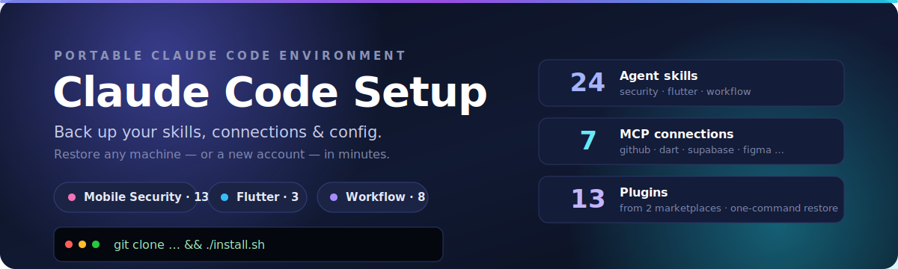
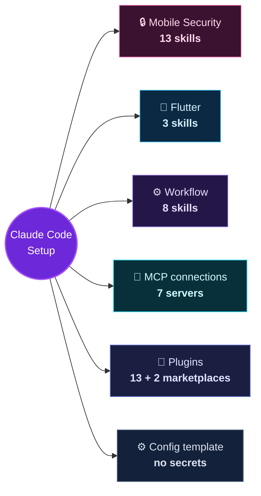
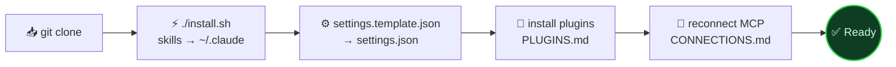
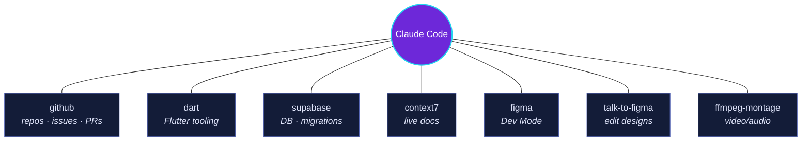

<p align="center">
  
</p>

<p align="center">
  <a href="LICENSE"></a>
  
  
  
  
  
</p>

<p align="center">
  <b>A portable, restorable <a href="https://claude.ai/code">Claude Code</a> environment.</b><br>
  24 agent skills · the MCP connections that power them · the plugin set · a sanitized config template.<br>
  Clone it onto any machine — or a brand-new account — and get the same setup back in a couple of minutes.
</p>

---

## Why this exists

Claude Code skills, MCP connections, plugins, and settings normally live only in
your local `~/.claude` folder. Reinstall your machine, switch accounts, or set up
a second workstation and it's all gone. **This repo is the backup** — everything
needed to reconstruct the environment, version-controlled and documented so
anyone can understand what each piece does.



---

## Quick start

```bash
git clone https://github.com/aymanaboelela/claude-code-setup.git
cd claude-code-setup
./install.sh
```

That copies every skill into `~/.claude/skills/`. Then finish the environment:

```bash
# 1. Config — copy the template and add your own token
cp config/settings.template.json ~/.claude/settings.json

# 2. Plugins — see docs/PLUGINS.md
# 3. MCP connections — see docs/CONNECTIONS.md
```

`./install.sh --force` overwrites existing skills of the same name;
`./install.sh --link` symlinks them so edits sync back into this repo.

### The full restore, at a glance



---

## What's inside

### 🧠 Skills → [`docs/SKILLS.md`](docs/SKILLS.md)

| Family | Count | Highlights |
|--------|:-----:|------------|
| 🔒 **Mobile Security** (OWASP MASVS / MASTG) | 13 | Threat modeling, pentest planning, MASVS checklist, a scriptable Top-10 scanner, and per-domain audits (auth, crypto, network, storage, privacy, platform, resilience, code). |
| 📱 **Flutter / Mobile Dev** | 3 | Flutter test authoring, remote-config seasonal app icons + splash, and self-drawing SVG logo animations. |
| ⚙️ **Workflow & Process** | 8 | TDD loop, skill authoring, session handoff, plan-grilling, PRD/issue generation, teaching, and a token-saving "caveman" mode. |

### 🔌 Connections → [`docs/CONNECTIONS.md`](docs/CONNECTIONS.md)

The MCP servers that were wired up — each with a copy-paste re-add command.
**No credentials are stored here**; you supply your own at connect time.



### 🧩 Plugins → [`docs/PLUGINS.md`](docs/PLUGINS.md)

13 plugins from the official `claude-plugins-official` marketplace and
`cloudflare/skills` (superpowers, frontend-design, code-review, github, figma,
vercel, stripe, firebase, cloudflare, and more), each with a one-line install
command.

---

## Repository structure

```
claude-code-setup/
├── README.md                     ← you are here
├── install.sh                    ← restore skills into ~/.claude/skills
├── LICENSE                       ← MIT
├── config/
│   └── settings.template.json    ← sanitized settings (no secrets)
├── docs/
│   ├── SKILLS.md                 ← full catalog of all 24 skills
│   ├── CONNECTIONS.md            ← MCP servers + re-add commands
│   ├── PLUGINS.md                ← plugins + marketplaces + install commands
│   └── assets/
│       └── banner.svg            ← the header art
└── skills/                       ← the 24 skill folders (SKILL.md each)
    ├── auth-assessment/
    ├── caveman/
    └── … (22 more)
```

---

## Full restore checklist (fresh machine)

1. Install Claude Code and sign in.
2. `git clone` this repo and run `./install.sh`.
3. `cp config/settings.template.json ~/.claude/settings.json` and replace `CLAUDE_CODE_OAUTH_TOKEN` with your own.
4. Add marketplaces and install plugins — [`docs/PLUGINS.md`](docs/PLUGINS.md).
5. Reconnect the MCP servers you use — [`docs/CONNECTIONS.md`](docs/CONNECTIONS.md).
6. Restart Claude Code. Run `/` to confirm the skills are listed.

---

## Security

- **No secrets are committed.** Tokens, API keys, and OAuth credentials are
  excluded by design; `settings.json`, `.claude.json`, and `.env` are
  git-ignored, and the config here is a placeholder template.
- The security skills bundle **example** insecure snippets (e.g. a fake
  `sk_live_…` key) purely as "what not to do" documentation — those are not real
  credentials.
- Found something that looks like it shouldn't be public? Open an issue.

---

## Contributing

Branches follow a simple flow: `main` is stable, `develop` is the integration
branch, and changes land through pull requests. To add or update a skill, branch
off `develop`, drop the skill folder under `skills/`, update
[`docs/SKILLS.md`](docs/SKILLS.md), and open a PR.

---

## License

[MIT](LICENSE) — see [`docs/SKILLS.md`](docs/SKILLS.md#attribution) for attribution
of third-party skills, whose original author metadata is preserved in their
frontmatter.
