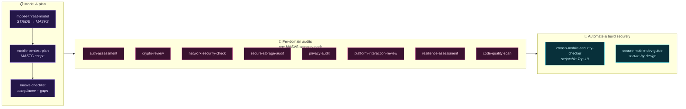
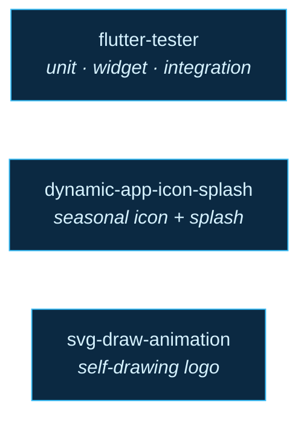
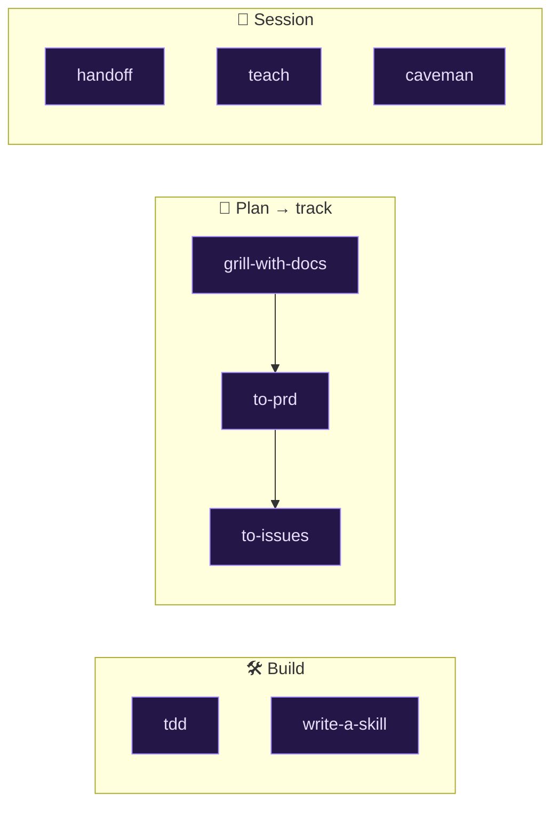

# 🧠 Skills Catalog

24 skills across three families. Each skill is a self-contained folder under
[`skills/`](../skills/) with a `SKILL.md` (and, where noted, bundled reference
docs, scripts, or assets).

**Invocation:** **Auto** = Claude can trigger it when the task matches ·
**Manual** = user-invoked only (`/skill-name`).

Jump to: [🔒 Mobile Security](#-mobile-security--owasp-masvs--mastg-13) ·
[📱 Flutter](#-flutter--mobile-development-3) ·
[⚙️ Workflow](#️-workflow--process-8) · [Attribution](#attribution)

---

## 🔒 Mobile Security — OWASP MASVS / MASTG (13)

A full mobile app security toolkit built around the OWASP **MASVS v2** verification
standard and **MASTG** testing guide: model the threats, plan the engagement, then
run per-domain audits and an automated Top-10 scan.

| Skill | Invocation | Covers |
|-------|:----------:|--------|
| [`mobile-threat-model`](../skills/mobile-threat-model/) | Manual | STRIDE threat model → MASVS |
| [`mobile-pentest-plan`](../skills/mobile-pentest-plan/) | Manual | Pentest scope & checklist (MASTG + NowSecure) |
| [`masvs-checklist`](../skills/masvs-checklist/) | Manual | MASVS v2 compliance + gap analysis |
| [`owasp-mobile-security-checker`](../skills/owasp-mobile-security-checker/) | Auto | OWASP Mobile Top 10 (2024) + Python scanners |
| [`auth-assessment`](../skills/auth-assessment/) | Auto | MASVS-AUTH — login, biometrics, sessions, MFA |
| [`crypto-review`](../skills/crypto-review/) | Auto | MASVS-CRYPTO — encryption, keys, hashing, RNG |
| [`network-security-check`](../skills/network-security-check/) | Auto | MASVS-NETWORK — TLS, pinning, cleartext |
| [`secure-storage-audit`](../skills/secure-storage-audit/) | Auto | MASVS-STORAGE — data-at-rest, leakage |
| [`privacy-audit`](../skills/privacy-audit/) | Auto | MASVS-PRIVACY — minimization, tracking, consent |
| [`platform-interaction-review`](../skills/platform-interaction-review/) | Auto | MASVS-PLATFORM — IPC, WebViews, deep links |
| [`resilience-assessment`](../skills/resilience-assessment/) | Auto | MASVS-RESILIENCE — anti-tamper, root/jailbreak |
| [`code-quality-scan`](../skills/code-quality-scan/) | Auto | MASVS-CODE — deps, input validation, injection |
| [`secure-mobile-dev-guide`](../skills/secure-mobile-dev-guide/) | Auto | Secure-by-design implementation guidance |

<b>Per-skill detail — expand</b>

- **`mobile-threat-model`** — builds a comprehensive STRIDE threat model mapped to MASVS controls. *When:* starting a new mobile project or before a security review.
- **`mobile-pentest-plan`** — produces a penetration-testing plan (scope, checklist, engagement prep) from MASTG methodology + NowSecure practices. *When:* preparing a security assessment.
- **`masvs-checklist`** — generates a MASVS v2 compliance checklist with MASTG test mappings and a gap analysis. *When:* you need a tracking document or compliance evidence.
- **`owasp-mobile-security-checker`** — audits against the OWASP Mobile Top 10 (2024). *Includes* runnable Python scanners: `scan_hardcoded_secrets.py`, `check_dependencies.py`, `check_network_security.py`, `analyze_storage_security.py`, plus a Top-10 reference. *When:* any audit or vulnerability sweep on a Flutter/mobile app.
- **`auth-assessment`** — reviews login flows, biometric auth, session management, MFA, and access control (MASVS-AUTH).
- **`crypto-review`** — audits encryption, key management, hashing, random-number generation, and protocol usage (MASVS-CRYPTO).
- **`network-security-check`** — checks TLS configuration, certificate pinning, and cleartext traffic (MASVS-NETWORK).
- **`secure-storage-audit`** — inspects how sensitive data is stored at rest and hunts for leakage (MASVS-STORAGE). Can fetch reference material.
- **`privacy-audit`** — reviews data minimization, user tracking, consent, and transparency (MASVS-PRIVACY).
- **`platform-interaction-review`** — audits IPC, WebViews, deep links, URL schemes, permissions, and content providers (MASVS-PLATFORM).
- **`resilience-assessment`** — evaluates anti-tampering, root/jailbreak detection, obfuscation, and anti-debugging (MASVS-RESILIENCE).
- **`code-quality-scan`** — flags vulnerable dependencies, input-validation gaps, injection, and outdated platform requirements (MASVS-CODE).
- **`secure-mobile-dev-guide`** — answers "how do I build *this* securely?" with guidance from the NowSecure Secure Mobile Development guide + MASVS + MASTG.

---

## 📱 Flutter / Mobile Development (3)

| Skill | Invocation | What it does |
|-------|:----------:|--------------|
| [`flutter-tester`](../skills/flutter-tester/) | Auto | Write / fix / review Flutter tests — unit, widget, integration, Riverpod, Mockito, GetIt, Given-When-Then. Ships 3 reference guides. |
| [`dynamic-app-icon-splash`](../skills/dynamic-app-icon-splash/) | Auto | Swap a Flutter app's launcher icon + in-app splash for seasons/occasions (Ramadan, Eid, sales) via remote config — **no store update**. |
| [`svg-draw-animation`](../skills/svg-draw-animation/) | Auto | Turn an SVG/logo into a Flutter "self-drawing" animation for splash screens and branded loaders. |

<b>Per-skill detail — expand</b>

- **`flutter-tester`** — layer-isolation strategies and Given-When-Then patterns for unit, widget, integration, and Riverpod tests; setup for GetIt, SharedPreferences, and FakeDatabase. *Includes* `references/` guides for widget testing, Riverpod testing, and layer patterns.
- **`dynamic-app-icon-splash`** — iOS alternate icons + Android `activity-alias`, `flutter_dynamic_icon_plus`, remote splash loading, and a `DynamicAppIconService`, all driven by remote config so branding changes ship without a store release. *Includes* a `REFERENCE.md`. Swap in your own bundle id / applicationId for the placeholders.
- **`svg-draw-animation`** — converts a logo into a stroke-on animation (the mark sketches itself) to replace a Lottie/spinner with your own brand. *Includes* SVG-inspection scripts and a ready Dart animation asset.

---

## ⚙️ Workflow & Process (8)

| Skill | Invocation | What it does |
|-------|:----------:|--------------|
| [`tdd`](../skills/tdd/) | Auto | Red-green-refactor TDD loop. Ships references on deep modules, interface design, mocking, refactoring, tests. |
| [`write-a-skill`](../skills/write-a-skill/) | Auto | Author new skills with proper structure, progressive disclosure, and bundled resources. |
| [`grill-with-docs`](../skills/grill-with-docs/) | Auto | Stress-test a plan against the domain model; update CONTEXT.md / ADRs inline. |
| [`to-prd`](../skills/to-prd/) | Auto | Turn the current conversation into a PRD in the issue tracker. |
| [`to-issues`](../skills/to-issues/) | Auto | Break a plan/PRD into independently-grabbable, tracer-bullet issues. |
| [`handoff`](../skills/handoff/) | Auto | Compact the conversation into a handoff doc for the next session/agent. |
| [`teach`](../skills/teach/) | Manual | Teach a concept in-workspace, tracking a learning record. |
| [`caveman`](../skills/caveman/) | Auto | Ultra-compressed comms mode — ~75% fewer tokens, full accuracy. |

<b>Per-skill detail — expand</b>

- **`tdd`** — drives features/bugfixes through the red-green-refactor loop. *Includes* references on deep modules, interface design, mocking, refactoring, and writing tests.
- **`write-a-skill`** — scaffolds new skills the right way (frontmatter, progressive disclosure, bundled scripts/refs). *When:* you want to add to this very collection.
- **`grill-with-docs`** — a "grilling" session that challenges your plan against the existing domain language and documented decisions, then updates CONTEXT.md and ADRs as they crystallize. *Includes* ADR and CONTEXT format templates.
- **`to-prd`** — converts the current context into a product requirements doc and publishes it to the issue tracker.
- **`to-issues`** — slices a plan/spec/PRD into vertical, independently-shippable "tracer bullet" issues.
- **`handoff`** — writes a compact handoff so another session/agent can pick up exactly where you left off. *Takes* a hint about what the next session is for.
- **`teach`** — walks you through a new concept or skill inside the workspace and tracks a learning record.
- **`caveman`** — a communication mode that drops filler/articles/pleasantries to cut ~75% of tokens while keeping technical accuracy. Trigger with `/caveman` or phrases like "be brief".

---

## Attribution

Skill folders are preserved verbatim, including any original `author` / `version`
metadata in their frontmatter (e.g. `flutter-tester` and
`owasp-mobile-security-checker` credit their original author). Several
workflow/security skills are adapted from the wider Claude Code and
[Superpowers](https://github.com/anthropics/claude-plugins-official) community.
This repository is a personal, restorable collection — credit stays with the
original authors where their metadata is present.
